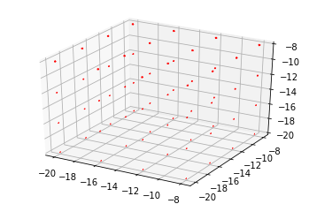
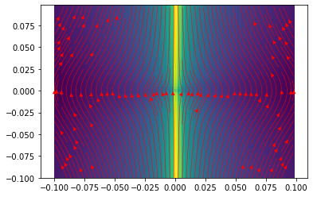
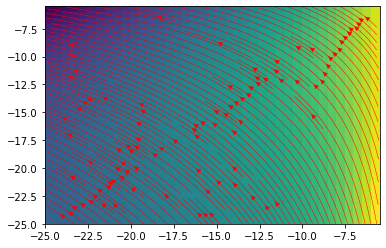
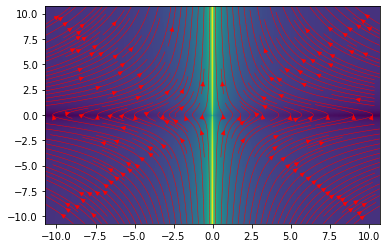
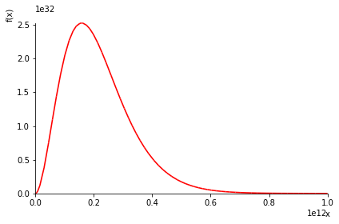
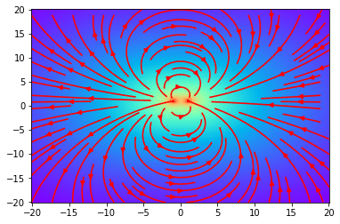
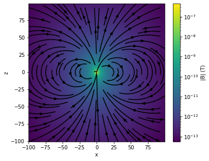
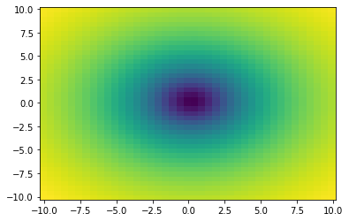
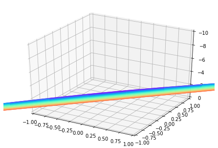
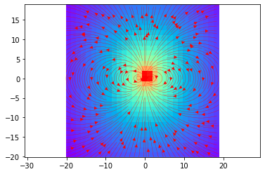

* content
{:toc}


$$
\color{red}{i\hbar\frac{\partial\psi}{\partial{ t}}=\hat{H}\psi} \\
\nabla\cdot{E}=\frac{\rho}{\epsilon_0}\\
\nabla\times{E}=-\frac{\partial{B}}{\partial{t}}\\
\nabla\cdot{B}=0\\
\nabla\times{B}=\mu_0 j+\mu_0\epsilon_0\frac{\partial{E}}{\partial{t}}\\
$$

$$
{\Large {\color{red}{这是一本}\color{purple}{有用}\color{green}{的}\color{blue}{记事本}}}
$$


```python
import numpy as np


import matplotlib

import matplotlib.pyplot as plt

import numpy.linalg as la
from scipy.integrate import quad
from sympy import *
from matplotlib.colors import LogNorm
import time
from cycler import cycler
import pandas as pd
plt.rc('lines', linewidth=1.6)
plt.rc('axes', prop_cycle=(cycler(color=['r', 'g', 'b', 'y','violet'] )+
                           cycler(linestyle=['-','--',':','-.','-'])))

from mpl_toolkits.mplot3d import Axes3D
start=time.time()
pi=3.1415926
#sympy 符号运算
x, y, z, alpha, beta ,gamma ,theta, phi,p,hbar,E,t= symbols('x y z alpha beta gamma theta phi,p,hbar,E,t')
#init_printing(use_unicode=True)
F,G,f,g,H=symbols('F G f g H',cls=Function)
import matplotlib.patches as mpathes
r=symbols('r')
r=sqrt(x**2+y**2+z**2)
theta=acos(z/r)
```


```python
from ipywidgets import interact
import ipywidgets as widgets
import sympy
from sympy import I
```


```python
'''
I = quad(integrand, 0, 1, args=(a,b))
result = integrate.quad(lambda x: special.jv(2.5,x), 0, 4.5) 积分
diff(cos(x), x)  求导
-sin(x)
>>> expr = sin(2*x) + cos(2*x) 
>>> expand_trig(expr) 
2*sin(x)*cos(x) + 2*cos(x)**2 - 1
plt.savefig('scatter.svg',dpi=600,format='svg')
''';
```


```python
diff(exp(x**2))
```


```python
1e-3*np.exp(2*3.1415*8.85e-12/3e-12)
```

# 计算模块测试

虚数单位i  大写字母 I


```python
a=I+1
a.diff(x)
```


$\displaystyle 0$


```python

```

------------

# 傅里叶分解


```python
def f1(n):
    a=sympy.fourier_series(exp(x),(x,0,1))
    sympy.plotting.plot( a.truncate(n),0,exp(x),(x,0,1),xlim=(0,1))
   
    #sympy.plotting.plot( a.truncate(n+1),(x,-1,1))
    '''
    for i in range(n):
        sympy.plot(a[i],(x,-1,1))
    '''
interact(f1,n=widgets.IntSlider(min=2,max=50,step=1,value=2)) 
```


    interactive(children=(IntSlider(value=2, description='n', max=50, min=2), Output()), _dom_classes=('widget-int…


    <function __main__.f1(n)>


```python

```


```python
a2=sympy.fourier_series(exp(x),(x,-1,1))
```


```python
def f2(x):
    return x**2
```


```python
a3=a2.truncate(3)
f4=sympy.lambdify(x,a3,'''numpy''')
f4(1)
```


    1.449503003675071


## cmap

cmaps = [('Perceptually Uniform Sequential', [
            'viridis', 'plasma', 'inferno', 'magma', 'cividis']),
         ('Sequential', [
            'Greys', 'Purples', 'Blues', 'Greens', 'Oranges', 'Reds',
            'YlOrBr', 'YlOrRd', 'OrRd', 'PuRd', 'RdPu', 'BuPu',
            'GnBu', 'PuBu', 'YlGnBu', 'PuBuGn', 'BuGn', 'YlGn']),
         ('Sequential (2)', [
            'binary', 'gist_yarg', 'gist_gray', 'gray', 'bone', 'pink',
            'spring', 'summer', 'autumn', 'winter', 'cool', 'Wistia',
            'hot', 'afmhot', 'gist_heat', 'copper']),
         ('Diverging', [
            'PiYG', 'PRGn', 'BrBG', 'PuOr', 'RdGy', 'RdBu',
            'RdYlBu', 'RdYlGn', 'Spectral', 'coolwarm', 'bwr', 'seismic']),
         ('Cyclic', ['twilight', 'twilight_shifted', 'hsv']),
         ('Qualitative', [
            'Pastel1', 'Pastel2', 'Paired', 'Accent',
            'Dark2', 'Set1', 'Set2', 'Set3',
            'tab10', 'tab20', 'tab20b', 'tab20c']),
         ('Miscellaneous', [
            'flag', 'prism', 'ocean', 'gist_earth', 'terrain', 'gist_stern',
            'gnuplot', 'gnuplot2', 'CMRmap', 'cubehelix', 'brg',
            'gist_rainbow', 'rainbow', 'jet', 'nipy_spectral', 'gist_ncar'])]

# 导体球 image charges


$$
\Phi(\mathbf{x})=\frac{q / 4 \pi \epsilon_{0}}{\left|x \mathbf{n}-y \mathbf{n}^{\prime}\right|}+\frac{q^{\prime} / 4 \pi \epsilon_{0}}{\left|x \mathbf{n}-y^{\prime} \mathbf{n}^{\prime}\right|}
$$

$$
\Phi(x=a)=\frac{q / 4 \pi \epsilon_{0}}{a\left|\mathbf{n}-\frac{y}{a} \mathbf{n}^{\prime}\right|}+\frac{q^{\prime} / 4 \pi \epsilon_{0}}{y^{\prime}\left|\mathbf{n}^{\prime}-\frac{a}{y^{\prime}} \mathbf{n}\right|}
$$

$$
\frac{q}{a}=-\frac{q^{\prime}}{y^{\prime}}, \quad \frac{y}{a}=\frac{a}{y^{\prime}}
$$

$$
\Large{q^{\prime}=-\frac{a}{y} q, \quad y^{\prime}=\frac{a^{2}}{y}}
$$


```python
def conducting_shpere(x2=10  ,a=2,   q2=-1): 
    
    i_q1=-q2*a/x2
    i_x1=a**2/x2
    d1=sqrt((x-x2)**2+y**2+z**2)
    d2=sqrt((x-i_x1)**2+y**2+z**2)
    p1=i_q1/d1
    p2=q2/d2
    p=p1+p2
    e1=sympy.lambdify([x,y,z],p.diff(x))
    e2=sympy.lambdify([x,y,z],p.diff(y))
    e3=sympy.lambdify([x,y,z],p.diff(z))

    w1=-a*2
    w2=a*2
    s11=0.51
    xx=np.arange(w1,w2,s11)
    zz,yy=np.meshgrid(np.arange(w1,w2,s11),np.arange(w1,w2,s11) )
    u=e1(zz,0,yy)
    v=e3(zz,0,yy)
    
    fig,ax=plt.subplots()
    
    abss=np.sqrt(u**2+v**2)
    ax.pcolor(xx,xx, abss,cmap='rainbow', norm=LogNorm())
    circle = mpathes.Circle([0,0],radius=a,fill=0)
    ax.add_patch(circle)
    plt.axis('equal')
    ax.streamplot(xx,xx,u,v,density=1,linewidth=0.3)
    #plt.savefig('414.svg')
   
```


```python
interact(conducting_shpere,x2=widgets.IntSlider(min=0,max=20,step=1,value=2),
         a=widgets.IntSlider(min=5,max=20,step=1,value=3)) 
```


    interactive(children=(IntSlider(value=2, description='x2', max=20), IntSlider(value=5, description='a', max=20…


    <function __main__.conducting_shpere(x2=10, a=2, q2=-1)>


表面电荷分布


```python

```


```python

```

------

# 某bvp问题的电场 

演算绘图测试结果

边界条件:
上半球面+V

下半球面-V 

$$
G\left(\mathbf{x}, \mathbf{x}^{\prime}\right)=\frac{1}{\left|\mathbf{x}-\mathbf{x}^{\prime}\right|}-\frac{a}{x^{\prime}\left|\mathbf{x}-\frac{a^{2}}{x^{\prime 2}} \mathbf{x}^{\prime}\right|}
$$


$$
G\left(\mathbf{x}, \mathbf{x}^{\prime}\right)=\frac{1}{\left(x^{2}+x^{\prime 2}-2 x x^{\prime} \cos \gamma\right)^{1 / 2}}-\frac{1}{\left(\frac{x^{2} x^{\prime 2}}{a^{2}}+a^{2}-2 x x^{\prime} \cos \gamma\right)^{1 / 2}}
$$


$$
\left.\frac{\partial G}{\partial n^{\prime}}\right|_{x^{\prime}=a}=-\frac{\left(x^{2}-a^{2}\right)}{a\left(x^{2}+a^{2}-2 a x \cos \gamma\right)^{3 / 2}}
$$

$$
\color{red}{\Phi(\mathbf{x})=\frac{1}{4 \pi} \int \Phi\left(a, \theta^{\prime}, \phi^{\prime}\right) \frac{a\left(x^{2}-a^{2}\right)}{\left(x^{2}+a^{2}-2 a x \cos \gamma\right)^{3 / 2}} d \Omega^{\prime}}
$$

这里
$$
\cos\gamma=\cos \theta \cos \theta^{\prime}+\sin \theta \sin \theta^{\prime} \cos \left(\phi-\phi^{\prime}\right)
$$

$$
\Large{\Phi(x, \theta, \phi)=\frac{3 V a^{2}}{2 x^{2}}\left[\cos \theta-\frac{7 a^{2}}{12 x^{2}}\left(\frac{5}{2} \cos ^{3} \theta-\frac{3}{2} \cos \theta\right)+\cdots\right]}
$$


```python
a5=(  cos(theta)-(7/12/r**2)*((5/2/cos(theta)**3 - 3/2/cos(theta)))  )
f5=sympy.lambdify([x,y,z],a5,'numpy')
xx, yy, zz = np.meshgrid(np.arange(-20, -5, 4),
                     np.arange(-20, -5,4),
                    np.arange(-20, -5, 4))
vx=diff(a5,x)
vy=diff(a5,y)
vz=diff(a5,z)
fx=sympy.lambdify([x,y,z],vx,'numpy')
fy=sympy.lambdify([x,y,z],vy,'numpy')
fz=sympy.lambdify([x,y,z],vz,'numpy')

u=fx(xx,yy,zz)
v=fy(xx,yy,zz)
w=fz(xx,yy,zz);
```


```python
from mpl_toolkits.mplot3d import Axes3D  # noqa: F401 unused import

import matplotlib.pyplot as plt
import numpy as np

fig = plt.figure()
ax = fig.gca(projection='3d')
ax.quiver(xx, yy, zz, u, v, w, length=1,arrow_length_ratio=3)
#plt.savefig('1.svg')
```




-------------

# 二维在zy平面


```python
import matplotlib.pyplot as plt
import matplotlib.gridspec as gridspec

def sph(wide1,wide2,step):
    fig,ax = plt.subplots()
    xx=np.arange(wide1,wide2,step)
    zz,yy=np.meshgrid(np.arange(wide1,wide2,step),np.arange(wide1,wide2,step) )
    xxx=np.zeros(zz.shape)
    u=fy(xxx,yy,zz)
    v2=fz(xxx,yy,zz)
    abss=(u**2+v2**2)**(1/2)
    
    plt.pcolor(xx,xx, abss, norm=LogNorm())
    plt.streamplot(xx,xx,u,v2, density=2, color='r',cmap='rainbow',norm=LogNorm(),linewidth=0.5)
    

 
    
    #c1=plt.Circle(np.array([0,0]),5)
    
    #ax.add_patch(c1)
    #plt.savefig('33.svg')
    #cb.set_label('|B| (T)')
    
sph(-0.1,0.1,0.0031)
```





```python
sph(-25,-5,0.5)
```





```python
sph(-10.74,10.74,0.031)
```





# 运算


```python
y1=6.626e-34
alpha1=1.380e-23
beta1=2.7
c1=y1*8*np.pi/(3e8)**3
planck=x**3/(exp(y1*x/alpha1/beta1)-1)
planck
```


$\displaystyle \frac{x^{3}}{e^{1.77831454643049 \cdot 10^{-11} x} - 1}$


```python
f6=sympy.lambdify(x,planck)
sympy.plot(planck,(x,0,1e12))
```





    <sympy.plotting.plot.Plot at 0x207691094c8>


# 对称正负电的电场


```python
d1=sqrt( (x-1)**2+(y-1)**2 )
d2=sqrt( (x+1)**2+(y-1)**2 )
d3=1/d1-1/d2
```


```python
g1=d3.diff(x)
g2=d3.diff(y)
d11=sympy.lambdify([x,y],g1)
d22=sympy.lambdify([x,y],g2)
w1=-20.11
w2=20.11
s11=0.2
xx=np.arange(w1,w2,s11)
zz,yy=np.meshgrid(np.arange(w1,w2,s11),np.arange(w1,w2,s11) )
u=d11(zz,yy)
v=d22(zz,yy)
abss=np.sqrt(u**2+v**2)
plt.streamplot(xx,xx,u,v)
plt.pcolor(xx,xx,abss,cmap='rainbow',norm=LogNorm())
```


    <matplotlib.collections.PolyCollection at 0x270e2d6d7c8>





```python
from SimPEG import Utils
import SimPEG.EM as EM


def run(XYZ=None, loc=np.r_[0., 0., 0.], sig=1.0, freq=1.0, orientation='Z',
        plotIt=True):


    if XYZ is None:
        # avoid putting measurement points where source is
        x = np.arange(-100.5, 100.5, step=1.)
        y = np.r_[0]
        z = x
        XYZ = Utils.ndgrid(x, y, z)

    Bx, By, Bz = EM.Analytics.FDEM.MagneticDipoleWholeSpace(
        XYZ,
        loc,
        sig,
        freq,
        orientation=orientation
    )
    absB = np.sqrt(Bx*Bx.conj()+By*By.conj()+Bz*Bz.conj()).real

    if plotIt:
        fig, ax = plt.subplots(1, 1, figsize=(6, 5))
        bxplt = Bx.reshape(x.size, z.size)
        bzplt = Bz.reshape(x.size, z.size)
        pc = ax.pcolor(x, z, absB.reshape(x.size, z.size), norm=LogNorm())
        ax.streamplot(x, z, bxplt.real, bzplt.real, color='k', density=1)
        ax.set_xlim([x.min(), x.max()])
        ax.set_ylim([z.min(), z.max()])
        ax.set_xlabel('x')
        ax.set_ylabel('z')
        cb = plt.colorbar(pc, ax=ax)
        cb.set_label('|B| (T)')


        return fig, ax

```


```python
run()
```


    (<Figure size 432x360 with 2 Axes>,
     <matplotlib.axes._subplots.AxesSubplot at 0x1ee83bfad08>)





# 在无限大平面诱导的电荷


```python
w1=-10.31
w2=10.31
step=0.5
h=5
xx=np.arange(w1,w2,step)
zz,yy=np.meshgrid(np.arange(w1,w2,step),np.arange(w1,w2,step))
d1=sqrt( (x-h)**2+(y)**2+z**2 )
d2=sqrt( (x-2)**2+(y)**2+z**2 )
pp=d1+d2
ex=sympy.lambdify([x,y,z],pp.diff(x))
ee=ex(0,yy,zz)
plt.pcolor(xx,xx,ee)


```


    <matplotlib.collections.PolyCollection at 0x26d28ba1f88>





```python
fig = plt.figure()
ax=Axes3D(fig)
ax.set_xlim(-1, 1)
ax.set_ylim(-1, 1)
ax.set_zlim(0,-10 )
ax.plot_surface(xx, xx,ee, rstride=1, cstride=1, cmap='rainbow')
```


    <mpl_toolkits.mplot3d.art3d.Poly3DCollection at 0x26d28973948>





# 一维波包的演化

自由粒子波函数
$$
\large{\psi(\boldsymbol{r}, t)=\frac{1}{(2 \pi \hbar)^{3 / 2}} \int_{-\infty}^{+\infty} \mathrm{d}^{3} p \varphi(\boldsymbol{p}) \mathrm{e}^{\mathrm{i}(p \cdot \boldsymbol{r}-Et) / \hbar} \quad\left(E=\frac{p^{2}}{2 m}\right)}
$$
知道波函数初值可以推波函数演化
$$
\psi(\boldsymbol{r}, 0)=\frac{1}{(2 \pi \hbar)^{3 / 2}} \int_{-\infty}^{+\infty} \mathrm{d}^{3} p \varphi(\boldsymbol{p}) \mathrm{e}^{\mathrm{i} p \cdot r / \hbar}
$$

$$
\varphi(p)=\frac{1}{(2 \pi \hbar)^{3 / 2}} \int_{-\infty}^{+\infty} \mathrm{d}^{3} r \psi(\boldsymbol{r}, 0) \mathrm{e}^{-i p \cdot r / \hbar}
$$


```python
free_particle=exp(-I*(p*x-E*t)/hbar)
free_particle
```


$\displaystyle e^{- \frac{i \left(- E t + p x\right)}{\hbar}}$


```python
a=fourier_transform(free_particle,x,p)
a
#算不出来
```


$\displaystyle \mathcal{F}_{x}\left[e^{\frac{i E t}{\hbar} - \frac{i p x}{\hbar}}\right]\left(p\right)$


```python
fourier_transform(exp(-I*x),x,p)
```


$\displaystyle \mathcal{F}_{x}\left[e^{- i x}\right]\left(p\right)$


```python
inverse_fourier_transform(a,p,x)
```


$\displaystyle \mathcal{F}^{-1}_{p}\left[\mathcal{F}_{x}\left[e^{\frac{i E t}{\hbar} - \frac{i p x}{\hbar}}\right]\left(p\right)\right]\left(x\right)$


# 环形电流（磁矩

$$
\begin{aligned}&\nabla \times B=\mu_{0} j\\&\nabla \times(\nabla \times B)=\nabla \times \mu_{0} j\\&\nabla(\nabla \cdot B)-\nabla^{2} B=\nabla \times \mu_{0} j\\&\nabla^{2} B=-\nabla \times \mu_{0} j\end{aligned}
$$

上面的nabla^2 是矢量laplace算子

类比phi的laplace方程

这里注意  右边是一个矢量
$$
B=\int \frac{-\nabla \times \mu_{0} j}{\left|\boldsymbol{r}-\boldsymbol{r}^{\prime}\right|^{3}}\left(\boldsymbol{r}-\boldsymbol{r}^{\prime}\right) d^{3} r
$$


```python
m=-z/r**3
g1=m.diff(y)
g2=m.diff(z)
d11=sympy.lambdify([x,y,z],g1)
d22=sympy.lambdify([x,y,z],g2)
w1=-20.11
w2=20.11
s11=1.3
xx=np.arange(w1,w2,s11)
zz,yy=np.meshgrid(np.arange(w1,w2,s11),np.arange(w1,w2,s11) )
u=d11(0,zz,yy)
v=d22(0,zz,yy)
abss=np.sqrt(u**2+v**2)
plt.streamplot(xx,xx,u,v,density=2.2,linewidth=0.3)
plt.pcolor(xx,xx,abss,cmap='rainbow',norm=LogNorm())
plt.axis('equal')
plt.savefig('磁矩.svg')
```





```python
m
```


$\displaystyle - \frac{z}{\left(x^{2} + y^{2} + z^{2}\right)^{\frac{3}{2}}}$


```python

```