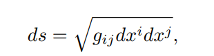
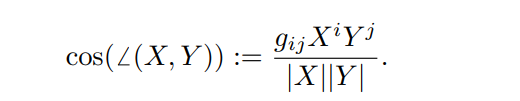
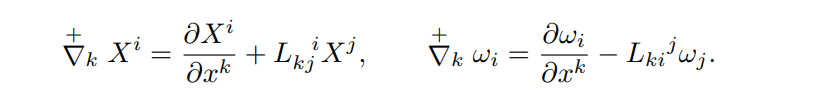

* content
{:toc}
读一读UFT的Review

## 历史回顾

### Introduction

随着历史的发展，物理学的大陆不断被探索，许多原本不相联系的部分逐渐被联系起来，很多物理在更高的层次得到了统一，电、磁与光、热力学与统计力学、惯性与引力。到了20世纪的下半叶，电磁相互作用和弱相互作用也被联系了起来，也即电弱理论。QCD的发展使得强相互作用也被统一进来，把我们带向通往基本粒子的标准模型的道路。然而引力是未能统一到一起的第四种基本相互作用，理论家们为此发展了许多的理论，推广经典广义相对论、超引力、超弦、超膜等，但都尚未成功。各种各样的统一理论的研究呈指数增加，已经成为了在理论家中流行的的一种时尚。

以回顾历史的眼光来看，统一场论的路径主要有两条，1）统一物理场的表示，2）统一物理场。对于前者，狭义相对论、现在的量子场论都是例子。Einstein也曾尝试通过这条路径将量子力学放进他的经典场论。对于后者，Maxwell的电动力学是一个例子，电和磁被统一成为一种场，磁场成为一种动力学的效应。接下来要谈到的许多统一场论大多数是第二种路径。显然第二条路径是必须包含第一条路径的，因为一种对于场的表示，新的表示总是必须的。但不管是何种尝试，都不能脱离实验，假设-检验与经验-归纳的方法论总是不可缺少的。在Einstein生命的后三十年时光里，Einstein的工作大部分聚焦在引力和电磁理论（也许还有其他相互作用）的统一之上。其他的理论家也其之前或者之后加入到统一场论的探寻当中，比如Mie、Hilbert、Ishiwara、Nordstrom等。然而不管在那个时代还是现在，统一场论的实验基础是缺失的，因为引力跟其他基本相互作用相比实在太弱了。尽管如此，许多数学上和物理上的新的观念与想法被提出，比如规范的想法、维数约化(Kaluza-Klein)等。

广义相对论抛弃了力的观念，认为动力学效应是时空弯曲的结果，也即引力几何化。取代力的是内涵更为丰富的关于时空的几何。在几何的观点之上，Einstein认为场方程的右边，即压强-能量张量$T_{ik}$是引力理论的一个小污点，因为它是一种没有几何意义的物质场。因此围绕这一点，在许多关于统一场论的设想当中，有两种观念，1）推广$T_{ik}$物质场，找到它更为本质的几何结构 ，2）不仅仅将引力几何化，而是同时将电磁场与引力几何化，紧接着是电子的场等等。在众多理论当中，对于物质的表示总是徘徊在点粒子（场的奇点）与场（无处不在的粒子，孤子，Soliton）之间。作为连续场理论的广义相对论，点粒子的概念某种意义上来说是有缺陷的。尽管如此，广义相对论当中的测地线被看成自由运动的`点粒子`的世界线。而点粒子又是一种奇点，它附近的场是发散的，因此要得到其运动方程似乎并不是一件显而易见的事情，物质将要如何影响自身的运动呢？J.A Wheeler(Feynman的老师)就曾提出过点粒子作为一种特殊的场的构造的想法，他提出Geon和geometrodynamics的概念。顺带一提，黑洞这个名字最早是Wheeler取的。Geon是一种粒子，翻译过来叫京子，它可以是光子，它在仅仅自己引力之下做圆周的运动。到了今天，场方程的一些孤子解也被找到了。但粒子与场的观念仍然不是完全清楚的。

大约在量子力学真正成型（1928）的前夕，1925-26年，Einstein曾对统一场论有这样的期望，希望它能够成为经典场论与量子理论之间巨大鸿沟的桥梁，甚至发展量子理论本身成为统一理论。他认为量子力学也许可以由他的统一场论附带的给出。可以想见，在量子力学成型的前夕，统一场论的想法是多么的诱人。尽管如此，Einstein后来承认，量子与物质总是使理论构造走向失败("It seems that the problem of matter and quanta makes the construction fall apart.”)。Einstein曾试图发展这样一种物质有不同质量但相同电荷的场论，他那时认为电子应当与质子配对，这样的尝试还是失败了。随着更多基本粒子被发现，到1933年的正电子被发现，Dirac的方程取得巨大成功。在后来的发展里，量子场论把场与物质视为一种对偶的关系，每种场都携带它们各自的如粒子一样的量子(quanta)。今天的量子场论与规范理论密不可分。物质被表示为一些算符，这些算符由一些`半整数`量子数来标记，即费米子。而`整数`量子数的场被视作传递相互作用的媒介，即玻色子。量子场论的时空几何通常不是弯曲的，而是四维的Minkowski时空。当然，在弦论或者膜理论里，时空（那些理论里的时空是否良定仍需讨论）也可以被推广到高维，10、11、26维，Lorentz协变性也可能缺失。把引力放入量子场论的各种方案仍然需要完善。

接下来的章节将会包含：
- 一些几何的观念 
- 理论家们对统一场论的早期的探寻
- 统一场论中发展起来主要的观念
- 数学家在微分几何当中的工作
- Einstein和他助手的工作
- 旋量的几何与QFT的几何化的尝试
- 转向放弃UFT的理论家
- 理论家们相互的影响
- 人们对于统一场论的接受程度

## 推广广义相对论的可能性

在引力几何化之后，理论家们也想要将电磁相互作用几何化来推广，这成为推广广义相对论的一个重要的部分。1）`[Wyle]`通过`规范`的思想对度规引入额外的线性项。2）`[Kaluza]`引入额外的维数。3）`[Eddington]`选择反对称的Ricci张量。4）`[Bach, Einstein]`在度规里加入反对称张量。5)`[Einstein]`以一个4-bein的场取代度规。这些道路大约有四个方向，即推广，1)几何、2)动力学（即场方程、或者说拉格朗日量）、3)数字场、4)空间的维数。

### 几何

物理事件的空间由一个光滑的流形来描述。流形上定义局域的坐标系，和光滑的矢量场以及它的对偶（微分形式）。在流形上的任意点，其所有线性无关的切矢量张成`切空间`。我们假定流形是类时或者是类空的，在此基础上，引出两种基本结构，`度规`与`仿射`。

度规$g$用来衡量一个$D$维度流形上两个很接近的点之间的距离，很自然地，我们要求它是正定的，关于两点是对称的。度规也反映矢量基和其对偶的长度度量。它是一个张量。我们通常采用的是对称的度规$g_{ij}=1/2(g_{ij}+g_{ji})=g_{(ij)}$,这样的度规只有$D(D+1)/2$个分量，如果它的特征值是正定的(负定),那么我们称它是黎曼度规。如果它的符号(矩阵的迹，时空的维数差)是$\pm(D-2)$的，则它是Lorentzian的。

仿射结构则通过线性的联络来引入，它是一种几何客体，但并非张量场，也就是说在坐标变换下并非协变或者逆变。`联络`的引入是为了比较流形上不同点的矢量。有了联络，可以构建`协变导数`，流形上的导数，矢量场和它的对偶的协变导数定义如下，

### 动力学

### Number field

### 维数

## UFT的最初尝试

## 1918-1923

## 微分几何的浪潮

## Einstein

## 电子场几何化

## Less than Unification

## 理论家们

## End_01

