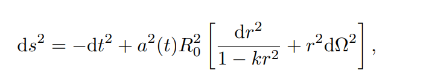
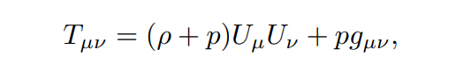
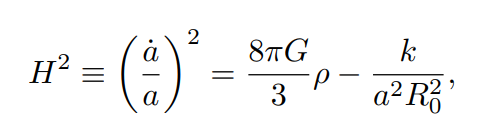
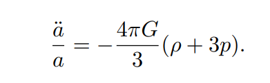
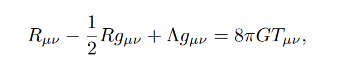
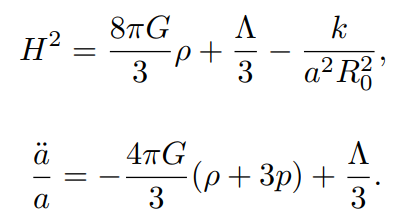

* content
{:toc}
读一读`宇宙常数`的Review

## 介绍

### Truth and beauty

科学就像是一间很难收拾整齐的房间。科学家总是追求一个统一、优雅、简洁的框架来解释万事万物，这是一种美学的观念。然而，为了能够将尽可能多的实验现象包括其中，这样一种美学的冲动常常会被牺牲掉。通常，一个理论，为了能够与实验数据相符合，可能必须做一些不自然的修正。有的时候，随着对于实验现象理解的加深，这样的修正可能会被抛弃。有的时候，当理论上的理解加深了之后，新的优美结构浮现出来，我们才会发觉这样的妥协是浅薄的。`广义相对论`作为一个强大而简洁的理论，就是一个典型的例子。但同时，`宇宙常数`也是一个典型的例子，关于修正的例子。最初Einstein引入宇宙常数，是为了得到一个静态的均匀宇宙解。但大约13年之后，观测表明宇宙并非静止，而是在膨胀。因此，在静态宇宙的层面，宇宙常数被放弃了，Einstein自称其为`一生中最大的错误`。但之后，理论家们开始考虑真空的能量时，发现`真空能`出现在Einstein场方程当中时，其效果与宇宙常数是一致的。因此，宇宙常数作为真空能又重新回到了场方程，它非零，但是它应当很小。同时也出现了著名的难题，粒子物理学家从计算量子场论中计算的真空能与宇宙学观测所限制的真空能相比，差了大约100个量级。理论家们为此兴奋，因为其中藏着未知的机制等着他们发现。

### 宇宙常数
Einstein场方程如下，这里将光速和约化Planck常数设做1，

在非常大的宇宙尺度上，认为空间的均匀与各项同性是一个不错的近似，可以用Robertson–Walker形式的度规来描述，

其中，$k$是曲率参数，$a(t)=R(t)/R_0$是空间的尺度因子。从这里可以定义一个有用的量，红移$a=1/(1+z),z=(\lambda-\lambda_0)/\lambda_0$,即因为空间尺度的变化，一个辐射的波长比原来增大的倍数。显然一个辐射的红移越高，这个辐射越老，所经历过的岁月越长。

一个均匀各向同性流体的压强-能量张量如下，

那么，从度规可以计算场方程的左边，从压强-能量张量得到场方程的右边，带入到场方程中去，会得到两个方程，人们称为Friedmann方程，

其中$H$就是Hubble常数。由于Mach原理，也由于那个时代的天文观测，Einstein想找的解是静态宇宙解，即$\dot{a}=0$。因此Einstein在场方程引入了宇宙常数$\Lambda$,

那么上面的Friedmann方程变成，宇宙常数作为一个自由参数来使得第一式变成零，这样空间尺度因子不随时间变化，哈勃常数为零，即静态宇宙。

这就是宇宙常数的出发点了，即得到静态宇宙。然而在之后的十几年里，哈勃常数被测出来不是零，宇宙确确实实在膨胀，而且还在加速膨胀，宇宙常数因此被抛弃了。然而潘多拉的魔盒一旦打开，要关起来并不简单，这就是真空能的故事了。

### 真空能

## 宇宙

### 宇宙学参数

### 不同宇宙的命运

### 结构演化

## 观测

### Ia超新星

### CMB

### 引力透镜

## 物理

### SUSY

### String

### 人存原理

## 结尾

